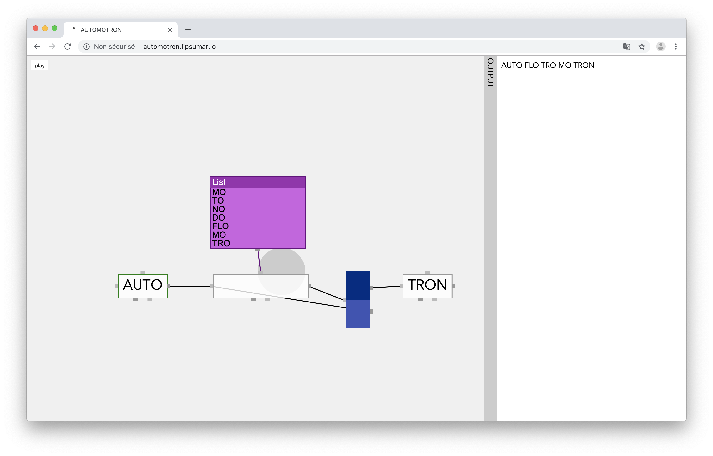
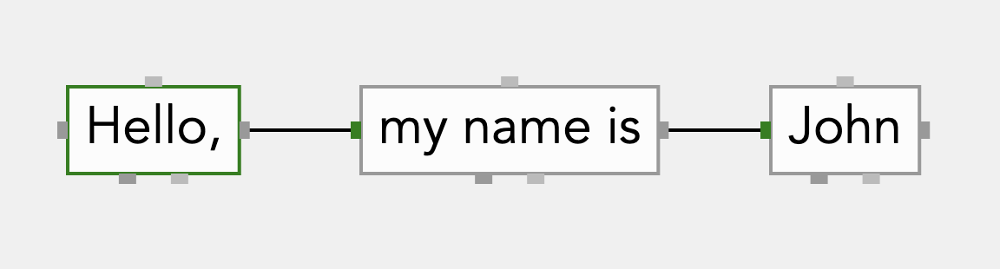
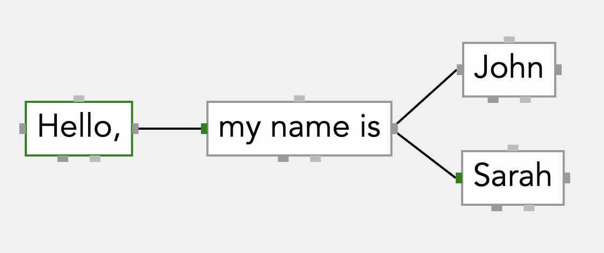
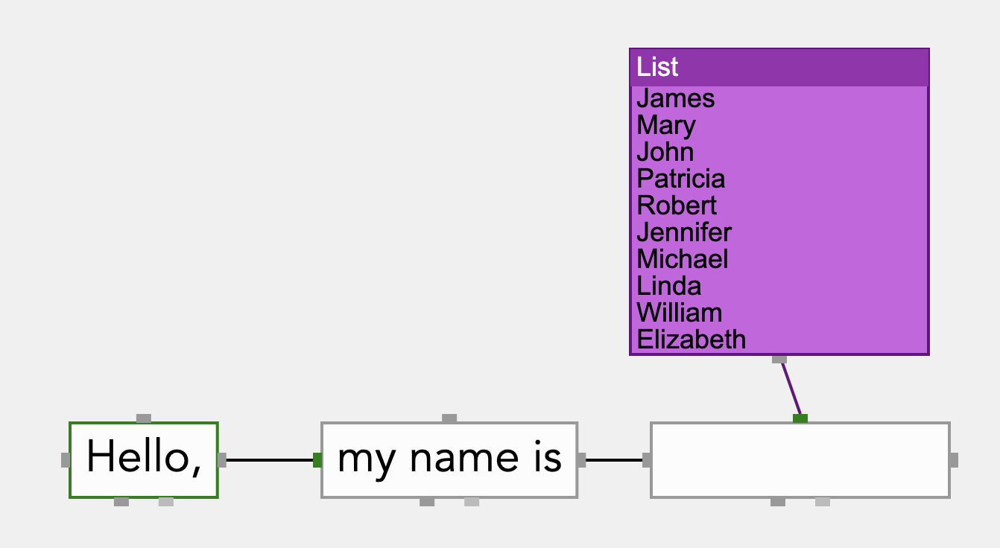
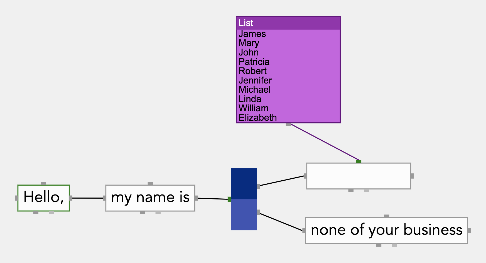
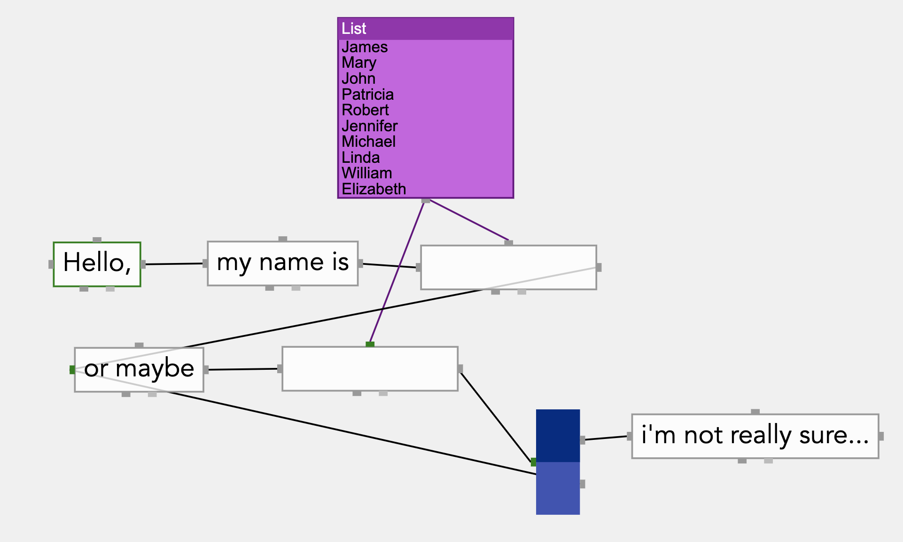

# AUTOMOTRON

> A visual language to generate text

_This is a work in progress_

* **Try it here: [automotron.io](http://automotron.io)**
* [Documentation en français :fr:](https://github.com/lipsumar/automotron/wiki/Documentation-FR)
* [API documentation](https://github.com/lipsumar/automotron/wiki/API)

## What is the AUTOMOTRON ?

The AUTOMOTRON is a visual language to generate texts. 

## How does it work ?

### Basics

The most basic blocks are the "containers". The containers are used to produce the output text. The container with a green border is always used as the starting point of the text.

This is the most basic example:

The above example will always produce the same text:

> Hello, my name is John

A container can be connected to more than one other container. This will create an alternate route:

The above example could produce:

> Hello, my name is John

or

> Hello, my name is Sarah

### Generators

Most often than not, generating texts will rely on long lists (for example a list of 50+ names). Representing long lists using separate containers and alternate routes is not practical. In such cases, containers can be connected to generators:

The above example could produce:

> Hello, my name is Mary

or

> Hello, my name is Jennifer

or

> Hello, my name is James

etc...

### Operators

Operators help to control the flow of the text, allowing loops or conditional structures.

The "split" operator allows to either go to route A or B. The chance A or B will be chosen can be defined, so there could be more chance to take a route than another

The above example could produce:

> Hello, my name is Patricia

or

> Hello, my name is none of your business

The split operator can be used to make loops, like so:

The above example could produce:

> Hello, my name is Michael or maybe Mary i'm not really sure...

or

> Hello, my name is Elizabeth or maybe Elizabeth or maybe Linda or maybe James or maybe Robert or maybe William i'm not really sure...

## Controls

* The map can be zoomed in or out with by scrolling up or down
* The map can also be moved by dragging on an empty area
* A double click in an empty area will create a container
* A double click on a container or list generator will edit it; afterwards, [cmd+enter] will save the changes
* A right clic on an empty area will open a menu to create a List or a Split
* A double click on a link will delete it
* The output tray can be closed by clicking on the gray bar
* To generate text, click "play" on top-left of the screen

